# 🌳 Plan T

---

> 사이트 바로가기
>
> Domain : [Plan T](http://plan-t.site/)
>
> 

<br>

## 최종프로젝트 경진대회 최우수상

총 22팀중

최우수 3개팀


## ✔ What is Plan T?

---

- Todo를 중점으로 한 개인 일정 관리 서비스와 스터디 커뮤니티를 통해 스터디 구성원들 간 공통 목표 Todo를 공유하는 웹 서비스

- 플랜을 짜다 의 Plan 과 식물의 Plant 를 합쳐 나를 키우는 계획이라는 뜻을 가지고 있다

- 프로젝트 기간 11.25 ~ 12.14
  
  | 구분       | 기간            | 활동              |
  |:--------:|:-------------:|:---------------:|
  | 프로젝트 기획  | 11.25 ~ 11.28 | 주제 선정 및 프로젝트 기획 |
  | 기본 기능 구현 | 11.29 ~ 12.13 | 기능 구현           |
  | 배포       | 12.14         | 배포              |
  | 문서 작성    | 12.13 ~ 12.14 | PPT , 기획서 정리    |
  | 프로젝트 발표  | 12.15         | 프로젝트 발표         |

<br>

## ✔ Plan T의 탄생 배경

---

- 사용해본 Todo 어플이나 스터디 어플 같은 경우에 개별적으로 일정을 관리해야 하기 때문에 일괄적으로 관리할 수 있는 서비스가 필요하다

- 기존의 플래너를 이용하지 않던 사용자의 유입을 위해서 필요한 기능들만 심플하게 구현한다

<br>

## ✔ 기술스택

* Version Control and Messenger

    

* Backend

   

* Frontend

    

* Infra

    

<br>

## ✔ 프로젝트 참여자

---

|                                                              |  이름  |  팀  |  역할  | 깃허브 주소                    |
| :----------------------------------------------------------: | :----: | :--: | :----: | ------------------------------ |
|  | 오채현 | 팀원 | 프론트 | https://github.com/chaehyun-oh |
|  | 류진숙 | 팀원 | 프론트 | https://github.com/wdahlia     |
| 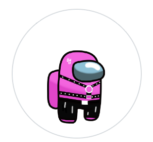 | 이동근 | 팀원 | 백엔드 | https://github.com/qlghwp123   |
| 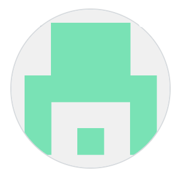 | 이성인 | 팀원 | 백엔드 | https://github.com/sungin95    |
|  | 이은진 | 팀원 | 백엔드 | https://github.com/OIIUOI      |

<br>

## ✔ 주요 기능

---

### 목차

* User
  * 사용자 관리
  * 로그인 / 로그아웃
  * 회원가입 / 탈퇴
  * 프로필 – 마이페이지
* Todo
  * Todo 생성, 조회, 수정, 삭제 (CRUD)
  * Todo 상세 조회
  * 오늘 / 일주일 / 전체 기간별 Todo 조회
* Study
  * 스터디 그룹 생성, 조회, 수정, 삭제 (CRUD)
  * 스터디 공유 Todo 생성, 조회, 수정, 삭제 (CRUD)
  * 스터디 기간 설정
  * 스터디 인원 제한 설정
  * 스터디 커뮤니티 별 실시간 채팅

<br>

### Todo

* todo 생성

  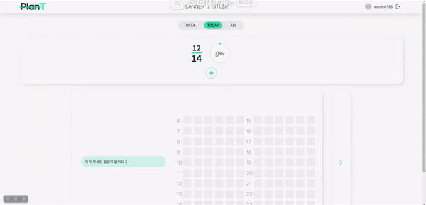

* todo 수정 및 삭제

  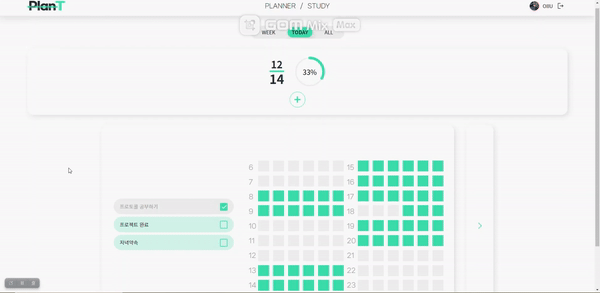

* todo week 조회

  

* todo all 조회

  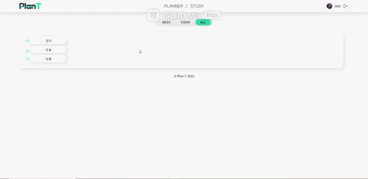

<br>

### Study

* 스터디 생성

  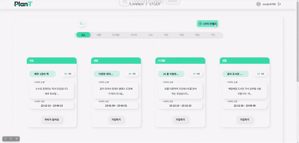

* 스터디 리스트 조회

  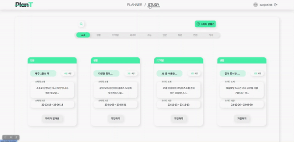

* 스터디 가입 신청

  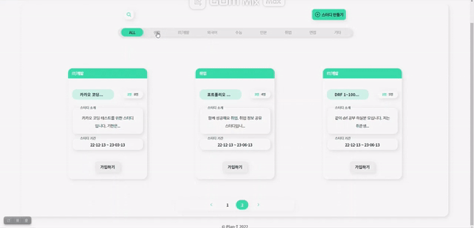

* 스터디 가입 수락

  

* 스터디 채팅

  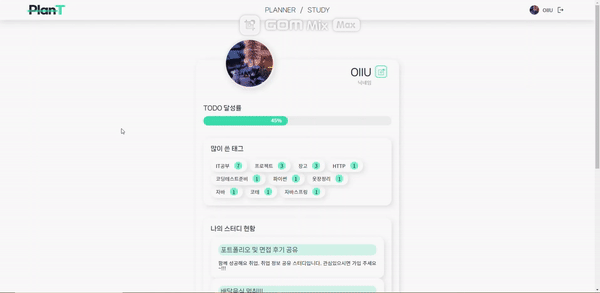

<br>

### Accounts

* 알림 메세지

  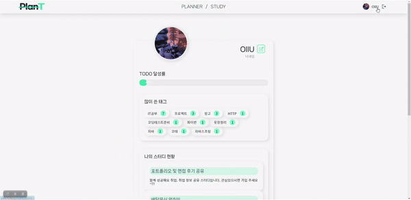

* 특정 태그의 todo list 조회

  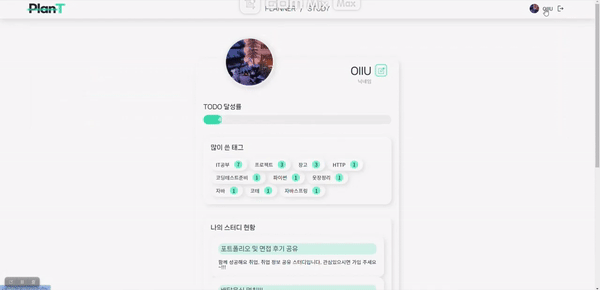

<br>

## 프로젝트 후기

- 오채현
  - 기획에서 생각했던 것처럼 간단하지 않아서 프로젝트 구현에 예상보다 시간이 오래 걸렸다.
  - 화면을 구성하는 것은 금방 끝났지만 js를 통한 이벤트 발생과 비동기에서 조금 어려움을 겪었었다.
  - 기간 내에 구현하기 위해 조금은 비효율적으로 작성한 코드들을 추후에 수정을 해서 프로젝트를 개선 시키고 싶다.
- 류진숙
  - 플래너를 만들어보고 싶다는 생각이 있었는데, 좋은 팀원들과 만들 수 있어서 행복한 시간이었다. 
  - 처음으로 DOM조작을 통해 자바스크립트 코드를 여러개 직접 작성해보고, 부트스트랩을 이용하지 않고 css로만 화면구성을 진행하였다는 점이 매우 뿌듯했다.
- 이성인
  - 버그 테스트의 중요성을 새삼 깨달았습니다. 기능이라는 것이 톱니바퀴와 같아서 서로 맞물리면서 잘 돌아가야 하는데요. 그런데 저는 톱니 바퀴만 만들고 나는 기능 개발 다 했어!!! 라고 했던 부분들이 꽤 있었습니다. 그리고 이 과정은 기능 개발 만큼이나 많은 생각을 해야 했습니다.
  - 코딩이라는 것이 나의 생각을 컴퓨터에게 전달하는 과정이고, 꽃을 피운다는 건 열매를 맺기 전에 가장 중요한 활동이라고 한다면, 버그 테스트야 말로 코딩의 꽃이 아닐까? 생각을 했습니다.
- 이은진
  - 많은 것들을 경험해보고 부딪혀보려고 했는데 생각만큼 잘 되지 않았어서 내가 좀 더 실력을 갖춘 사람이 되어야겠다고 다짐했고 공부도 스스로 많이 하고 토이프로젝트도 혼자서 만들어 봐야겠다고 생각했습니다
- 이동근
  - 플래너, todo, 다이어리와 같은 기록 관련 서비스는 전혀 사용해본 경험이 없어서 구현에 있어서 좀 헤맸지만, 좋은 경험이었다.

<br>


## 제 입장(백엔드, 이성인)에서 바라본 개발을 진행하면서 어려웠던 점

### Todos

#### 나열 기준

|           | 기존 |     플래너     |
| :-------: | :--: | :------------: |
| 나열 기준 |  pk  | 수행 예정 날짜 |

맨 처음으로 어떻게 구조를 가져올지 구상하면서 느꼈던 막막함은 기존에 모델링은 주로 제품이나 상품이 중심이었는데. 플래너는 시간이 중심이다는 점이었습니다. 다르다고 느꼈던 것이 기존에는 주로 PK값을 중심으로 생성된 순서대로 나열을 하였는데. 플래너 같은 경우 내가 **수행할 예정인 날짜**를 중심으로 나열이 필요했습니다. 

그 동안 프로젝트를 하면서 음식점, 댓글, 게시글, 제품 등 많은 CURD를 해 보았지만 항상 생성된 시간이 중요했고, 그래서 날짜는 항상 `auto_now_add=True`를 사용하여 나타내기만 했는데. 처음으로 사용자로 부터 날짜를 받아와서, 그 날짜를 중심으로 사용자에게 데이터를 보여줘야 했습니다. 어려운 문제는 아니었지만, 익숙하지 않은 새로운 구조라서 처음에는 많이 당황을 했습니다. 

#### week

플래너를 만들다 보니 이걸 주 단위로 보여주는 페이지가 필요했습니다. 그런데 여기서 발생한 문제가 만약 오늘이 2022년 12월 13일 화요일이라면 이틀 전인 11일 부터 17일까지를 보여줘야 했고, 15일이라면 4일 전부터 보여줘야 했습니다. 

이 문제를 해결하기 위해 찾아보니 요일을 숫자로 나타내 주는 함수가 있었습니다. 그리고 이 값을 바탕으로 일요일에 해당하는 날짜를 찾을 수 있었고 그 날짜를 기준으로 7일을 보여줌으로써 문제를 해결할 수 있었습니다. 

여기에 이번주 다음주의 값도 보여 줘야 했는데. 저는 이 문제를 주소창을 통해 0,1,2,-1,-2등을 받게 해서 0이면 이번주 1이면 다음주 -1이면 지난주를 보여줄수 있게 설계를 했습니다..

문제를 해결하고 기분좋게 프론트 친구에게 이게 이런식으로 변수화 해서 데이터 보낼줄께 라고 했는데. 프론트를 하는 친구는 다음주 지난주로 이동 할 때 비동기를 통해 구현을 하고 싶다고 했습니다. 음... 그러면 return 값만 JsonResponse으로 보내 주면 되겠네라고 생각을 했는데. 그렇게 하니까 처음에 화면을 불러올때 문제가 발생을 하였고, 이걸 해결하기 위해 week(동기)와 week(비동기)로 나누었고, 맨처음에는 무조건 동기로 된 페이지를 불러오게 하였고, 이 페이지에서 지난주로 가기는 다음주로 가기로 클릭을 하면 비동기 페이지를 불러오는 방식을 택했습니다. 


### Studies

#### index(스터디방 목록 페이지)

[planT index페이지](http://plan-t.site/studies/)

[깃허브 index HTML](https://github.com/sungin95/Final-project/blob/main/templates/studies/complete/study_index.html)

[깃허브 studies views.py](https://github.com/sungin95/Final-project/blob/main/studies/views.py)

목록을 내타낼때 카테고리, 검색, 페이지 네이션 3가지 종류로 나타냈습니다. 

이 셋은 모두 주소창에 띄는 입풋 값을 통하여 나타나게 됩니다. 그런데 무작정 이 셋을 넣고 보니 검색을 하면 카테고리가 사라지고 페이지 네이션을 누르면 검색과 카테고리가 사라지는 문제가 발생하였습니다. 

이 문제를 해결하기 위해서 우선 순서를 정했습니다. 

예를 들어 보통 카테고리를 클릭하는 순간은 새롭게 찾을 때이고, 검색을 한다면 현재 카테고리에서 정보를 찾을 거라고 생각했습니다. 그리고 페이지 네이션을 클릭할 때는 카테고리랑 검색내용이 유지 되어야 한다고 보았습니다. 

순서: 카테고리 > 검색 > 페이지네이션

순서를 정하고 나서는 HTML페이지에서 input값이 유지가 될 수 있도록 조치를 취할 필요가 있었습니다. 우선 검색할 때 현재 클릭한 카테고리가 유지가 되도록 만들기 위해 숨김 처리를 해서 사용자는 모르지만 해당 카테고리값을 다시 불러 올 수 있도록 설계를 했습니다. 

```html
<input type="text" name="tabmenu" value="{{category}}" style="display: none;">
```


페이지 네이션은 모두를 고려해 주기 위해 현재페이지에서 아래의 3개의 값을 다시 불러오도록 설계를 했습니다. 

```html
<a class="page-link" href="?page={{ page_number }}&search={{search}}&tabmenu={{category}}">{{ page_number }}</a>
```


마지막으로는 views.py 에서 해당 순서대로 코드를 추가 할 수 있도록 설계를 했습니다.

```python
def index(request):
    category = request.GET.get("tabmenu")

    # 카테고리
    if category is None or category == "on" or category == "None":
        category_studies = Study.objects.all().order_by("-pk")
    else:
        category_studies = Study.objects.filter(category=category).order_by("-pk")

    # 검색
    search = request.GET.get("search")
    if search is not None and search != "None":
        studies = Study.objects.all()
        search_lists = studies.filter(
            Q(title__icontains=search) | Q(desc__icontains=search)
        )
        category_studies = category_studies & search_lists
    # 페이지 네이션 코드
    page_number = request.GET.get("page")
    paginator = Paginator(category_studies, 8)
    page_list = paginator.get_page(page_number)

    context = {
        "category_studies": category_studies,
        "page_list": page_list,
        "category": category,
        "search": search,
    }

    return render(request, "studies/complete/study_index.html", context)
```


#### 스터디 가입신청, 수락과 거절(반장) (개념)

[깃허브 studies views.py](https://github.com/sungin95/Final-project/blob/main/studies/views.py)

258~385

스터디 가입과 수락을 만들때 가장 어려웠던건 어떻게 모델링을 짤 것인가 였습니다. 이때 생각이 난게 각 유저가 여러개의 스터디에 대하여 가입 신청을 할 수 있고, 스터디도 여러 유저를 받을 수 있다고 생각해 `ManyToManyField`를 사용하자 생각했습니다. 비슷한 모델로는 User간의 팔로우를 생각했고, 한쪽이 팔로우를 누르면 가입, 상대편도 맞팔을 해 주면 수락으로 만들면 되겠다고 생각을 했습니다. 

팔로우 개념으로 스터디 만듬

|        | 한쪽만 | 서로 |
| :----: | :----: | :--: |
| 팔로우 | 팔로우 | 맞팔 |
| 스터디 |  가입  | 수락 |

이걸 위해 `Study`에서 `participated`라는 가입 신청한 인원을 받는 필드를 만들고, `User`에서 `join_study`이라는 가입된 스터디 목록을 나타내는 필드를 만들었습니다. 예시를 들면

| Study - participated (가입신청) |      | User - join_study (수락) |
| :-----------------------------: | ---- | :----------------------: |
|             A(반장)             |      |         A(반장)          |
|             B(멤버)             |      |         B(멤버)          |
|           C(가입신청)           |      |   (C만 목록에서 보임)    |

위 표 처럼 반장은 자동으로 양쪽에 생성되도록 하고, B 처럼 가입신청후 수락까지 받으면 멤버, C처럼 가입 신청만 한 상태면 수락 목록에서만 보이도록 설계를 했습니다. 


#### info(가입페이지)

스터디를 운영한다면 등록된 멤버만 사용이 가능해야 하니까 페이지를 둘로 나누어야 한다고 생각했습니다. 우선 유저가 가입되기 전에 스터디를 소개하는 페이지가 필요하고, 유저가 가입되고 활동하는 페이지가 필요했습니다. 

info 페이지는 모두가 볼 수 있는 페이지이고 study에 대한 정보를 한눈에 볼 수 있게 설계를 했습니다. 

####  detail(멤버 활동 페이지)

detail 페이지는 멤버들이 활동하는 공간으로 스터디에서 진행하는 할일 목록을 보여줘야 했고, 반장에게는 현재 멤버는 아니면서 가입은 신청한 사람의 목록을 보여주도록 설계를 했습니다. 

##### 인증

동시에 detail페이지는 멤버들만 들어올 수 있게 해야 했기 때문에 인증기능을 넣었습니다. 인증은 프론트에서 한번, 백에서 한번 진행을 했습니다. 

```python 
# 백에서 
study_ = get_object_or_404(Study, pk=study_pk)
# 로그인한 유저가 스터디 가입신청 목록에 있는지
if request.user in study_.participated.all():
    # 스터디가 로그인 유저를 멤버로 받아 들였는지
    if study_ in request.user.join_study.all():
        ...
        ...
        ...
        return render(request, "studies/complete/study_detail.html", context)
    
messages.error(request, "인증된 유저만 접근 할 수 있습니다.")
return redirect("studies:index")
```


프론트에서는 장고 템플릿에서 제공하는 if문을 활용하여 링크(a태그)를 바꾸어 주는 방식으로 구분을 주었습니다. 

```html
<!-- index페이지 -->
<div class="study-footer">
    
    	
    		<a href="" class="join-btn">진입하기</a>
	    
    		
			    <a href="" class="join-btn">자리가 없어요</a>
		    
			    <a href="" class="join-btn">가입신청중</a>
		    
	    
    
    	
		    <a href="" class="join-btn">자리가 없어요</a>
	    
		    <a href="" class="join-btn">가입하기</a>
	    
    
</div>
```

이때 좀 더 자세히 표현 해 주었으면 좋겠다는 의견이 있어서 최대한 다양하게 보여 줄 수 있도록 설정을 했습니다. 

진입하기 => detail페이지 바로 가기

자리가 없어요 => info페이지 들어가기, 멤버수가 초과시 뜨도록 설정(들어갈 수는 있지만 신청은 불가하도록 설정)

가입 신청중 => info페이지 들어가기, 가입하기 누른 상태

가입 => info페이지 들어가기


##### 수락과 거절

- 반장만 가능
  - 수락과 거절은 기본적으로 반장만 가능합니다. 이걸 위해 HTML템플릿에서 if문을 활용해 반장만 볼 수 있게 하였고, views.py에서도 request.user가 반장인지 아닌지 확인하는 코드를 추가 했습니다. 

- POST사용 이유
  - 그리고 나쁜 유저가 주소창을 통하여 반장 대신 수락 or 거절을 할 수 있다고 생각했습니다. 이걸 방지하기 위해 GET이 아닌 `request.method == "POST"`를 추가했습니다. 

- 비동기 
  - 또한 수락 버튼 하나 클릭하고 페이지가 다시 시작되는 것을 막기 위해 비동기로 진행을 하였습니다. 
  - 목록이 for 문으로 반복이 되기 때문에  변수를 정의해 줄때 id가 아닌 class를 통하여 진행을 하였고, `querySelectorAll`와 `for...of...`을 사용하여 이벤트가 발생하면 목록을 모두 체크하는 방식을 택했습니다. 


##### studies_Todos 생성

todos는 반장이 생성하면 공유하는 형태로 만들고 싶었습니다. 그래서 멤버를 조회하는 코드를 짜고 for문을 이용해 반복하고 user_id를 각각 멤버로 하게 코드를 만들었습니다. 처음에는 save()를 반복하면 생성이 될 거라고 생각을 했는데. 생성은 안되고 user_id만 바뀌어서 생성되는 시점이 `todoForm = StudyTodosForm(request.POST)`가 아닐까 생각을 해서 이 부분을 반복해서 문제를 해결 했습니다. 

```python
# 가입된 멤버 조회
joined_member = []
for user in study.participated.all():
    for studyy in user.join_study.all():
        if studyy.pk == study_pk:
            joined_member.append(user)
            break

# 가입된 멤버 각각 생성
for userr in joined_member:
    todoForm = StudyTodosForm(request.POST)

    if todoForm.is_valid() and study.owner == request.user:
        todo = todoForm.save(commit=False)
        todo.study_pk = study
        todo.user_id = userr
        todo.management_pk = study_todos_management
        todo.save()
```


#### 수락과 탈퇴

##### 추후 기능 확대를 대비(현재: 수락(반장), 탈퇴(팀원),  추후: 초대(반장),  강퇴(반장))

[깃허브 studies views.py](https://github.com/sungin95/Final-project/blob/main/studies/views.py)

294 ~385

저는 이 수락과 탈퇴 기능을 만들때, 나중에 초대기능과 강퇴기능을 만들 수 있다고 생각했습니다. 이때 문제가 된다고 생각했던 부분이 탈퇴와 강퇴였습니다. 이 두 기능은 User - join_study 에서 해당 스터디를 삭제하는 기능인데. 탈퇴는 삭제를 하고 해당 유저를 스터디방에서 나가게 해야 했고, 강퇴는 반장이 하는 기능으로 비동기로 처리를 해야 했습니다. 물론, 따로따로 만들어서 문제를 해결 할 수도 있었지만, 같은 코드가 반복되는 형태를 피하고 싶었습니다. 

고민을 하다가 결국 이걸 클릭한 주체가 반장이라면 현재페이지를 유지하고, 팀원이라면 이 페이지를 나가게 만들면 된다고 생각을 했습니다. 

```python
# 반장은 owner, 멤버는 not owner, 나쁜 사용자는 redirect
if request.user == study.owner:
    owner__ = True
elif request.user == user:
    owner__ = False
else:
    # 제3의 유저를 걸려내기 위해 추가 제작
    messages.error(request, "잘못된 요청입니다.")
    return redirect("studies:index")
...
...
...
# 반장이면 페이지 유지
if owner__ == True:
    context = {
        "member_number": member_number,
        "studyJoinNumber": studyJoinNumber,
        "check": True,
    }
    return JsonResponse(context)
# 멤버면 index로 보냄
elif owner__ == False:
    # messages.success(request, "정상적으로 탈퇴가 되었습니다.")
    return redirect("studies:index")
```


##### 후처리(스터디 수락 or 탈퇴시 studies_todos 어떻게 할 것인지)

기능을 완성하고 버그 테스트를 하면서 스터디 탈퇴가 정상적으로 작동하나 확인하는 도중, 스터디에 탈퇴를 했지만 여전히 Studies_Todos가 남아 있는것을 확인했다. 

이걸 통해 2가지를 생각했다. 스터디 **탈퇴시** 관련 Studies_Todos를 **삭제**를 해야한다. 그리고 스터디 **가입시** 진행중인 Studies_Todos를 **생성**해 줘야 한다. 그래서 아래 코드 추가

```python
today = str(datetime.now())[:10]
# 수락과 동시에 아직 안끝난 studies_todos 생성
study_todos = StudyTodos.objects.filter(
    user_id=study.owner,
    study_pk=study,
    end__gte=today,
)
for study_todo in study_todos:
    StudyTodos.objects.create(
        study_pk=study,
        management_pk=study_todo.management_pk,
        user_id=user,
        title=study_todo.title,
        content=study_todo.content,
        start=study_todo.start,
        end=study_todo.end,
    )
```

```python 
# 스터디 관련 todos 삭제
delete_studies_todos = StudyTodos.objects.filter(
    user_id=user,
    study_pk=study,
)
for delete_studies_todo in delete_studies_todos:
    delete_studies_todo.delete()
    #
```


